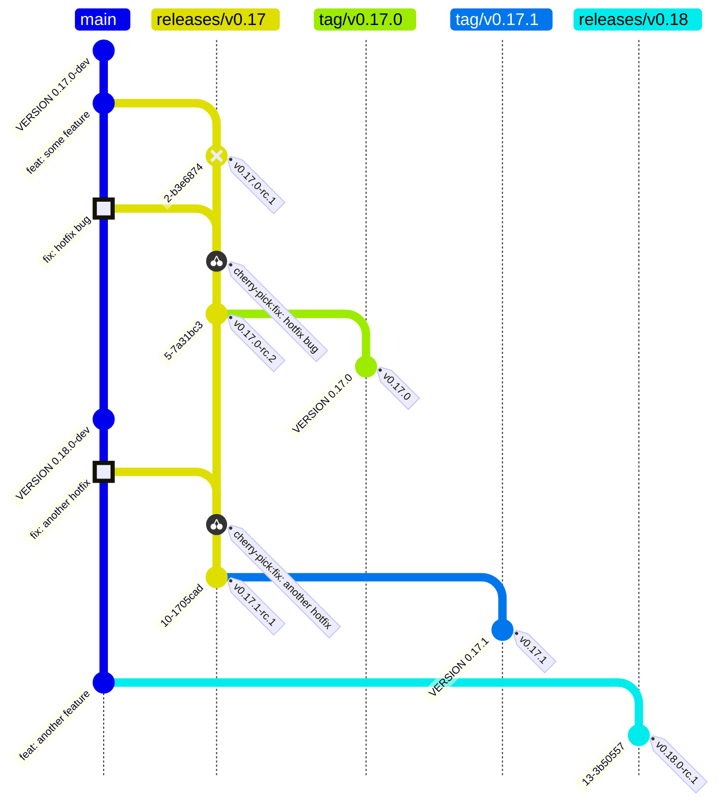

# Release Process

This guide is for OCM release managers.

Scope: **CLI and Kubernetes Controller are released together in version lockstep** (RC and final).

---

## General Information

### Context and scope

Development in the [Open Component Model monorepo](https://github.com/open-component-model/open-component-model)
happens on `main`, while releases are prepared and promoted from release branches (`releases/v0.X`).
This repository follows a lockstep release model for multiple components — currently the
[CLI](https://github.com/open-component-model/open-component-model/tree/main/cli) and the
[Kubernetes Controller](https://github.com/open-component-model/open-component-model/tree/main/kubernetes/controller).

### Release cadence

The default cadence is sprint-based. At the start of each sprint, create a Release Candidate (RC)
for the current release branch. The workflow automatically handles final promotion after a 14-day
waiting period and required approval.

Patch releases are handled out-of-band and created on demand for critical fixes.
A scheduled release can be skipped if the branch is not ready or there are no meaningful changes.

### Release Responsible

The release responsible coordinates and executes the release flow.
This role rotates each sprint and involves:

- Triggering and supervising release branch creation
- Creating release candidates for all lockstep components
- Approving final promotions after the waiting period
- Coordinating patch releases when needed
- Keeping this guide accurate and up to date

**Quick links:**
[Create release branch](#1-create-the-release-branch) ·
[Create RC](#2-create-a-release-candidate-cli--controller) ·
[Approve Final](#3-approve-final-promotion-cli--controller) ·
[Patch release](#4-create-a-patch-release-if-needed)

### Release Checklist

Copy this checklist to your "Sprint Responsible" issue:

```markdown
- [ ] Release branch created (`releases/v0.X`)
- [ ] CLI release workflow started (RC created and verified)
- [ ] Controller release workflow started (RC created and verified)
- [ ] (wait 14 days for environment gate)
- [ ] CLI Final approved in GitHub UI
- [ ] Controller Final approved in GitHub UI
- [ ] Both releases visible on GitHub Releases page
```

### Timeline

| When | Action |
|------|--------|
| Sprint Start | Start release workflows (creates RCs) |
| After 14 Days | Approve final promotions in GitHub UI |
| Sprint End | Assign next release responsible |

### Guardrails

Once a release branch is created, it enters cut-off mode:
no feature or breaking-change work is accepted.
All fixes must go to `main` first, then be cherry-picked to the release branch.

---

## Release Workflow Diagram

The following diagram illustrates a typical release cycle with an initial release (`v0.17.0`)
and a subsequent patch release (`v0.17.1`):



---

## What to do

### 1) Create the release branch

A new release branch marks the cut-off point for that minor release line.
Once created, only bug fixes and documentation changes are allowed.

1. Run workflow **[Release Branch Creation](./.github/workflows/release-branch.yml)**.
2. Set target branch to `releases/v0.X`.
3. Confirm the branch was created successfully.

<details>
<summary>Cut-off policy for this release branch</summary>

- No feature or breaking-change work is accepted.
- Non-bugfix and non-documentation changes require release responsible approval.
- Non-critical bug fixes require release responsible approval.
- Fixes must be merged to `main` first, then cherry-picked to this branch.
- Do not introduce release-branch-only commits unless explicitly approved.

</details>

<details>
<summary>What happens in the background?</summary>

- Validate `target_branch` against `releases/v0.X`.
- Normalize `source_branch` (default `main`) and resolve its HEAD SHA.
- Create `refs/heads/<target_branch>` from source SHA, or skip if target already exists.
- Publish source, target, and commit SHA in the workflow summary.

</details>

### 2) Create a Release Candidate (CLI + Controller)

Release candidates are created for both components. The workflow handles both RC creation
and final promotion in a single run, with a 14-day environment gate in between.

1. Run workflow **[CLI Release](./.github/workflows/cli-release.yml)** with:
   - `branch` = `releases/v0.X`
   - `dry_run = true` first to validate
   - `dry_run = false` for actual release
2. Run workflow **Controller Release** with equivalent inputs
   (once `controller-release.yml` is available).
3. Verify both pre-releases were created successfully on the GitHub Releases page.
4. The workflow will now wait at the environment gate for 14 days + approval.

> ⚠️ **Always do a dry-run first** before the actual release.

> CLI and Controller are released together. Do not release only one of them.

<details>
<summary>What happens in the background?</summary>

**Single workflow run handles both RC and Final:**

```
┌─────────────────────────────────────────────────────────────────────────────┐
│                              PHASE 1: RC                                    │
├─────────────────────────────────────────────────────────────────────────────┤
│  prepare ──▶ tag_rc ──▶ build ──▶ release_rc                               │
│     │          │          │           │                                     │
│     │          │          │           └─▶ Create GitHub pre-release         │
│     │          │          └─▶ Build binaries, OCI image, attest all        │
│     │          └─▶ Create annotated RC tag                                  │
│     └─▶ Compute version, generate changelog                                 │
├─────────────────────────────────────────────────────────────────────────────┤
│                         ENVIRONMENT GATE                                    │
│                     cli/release (14 days + approval)                        │
├─────────────────────────────────────────────────────────────────────────────┤
│                            PHASE 2: FINAL                                   │
├─────────────────────────────────────────────────────────────────────────────┤
│  verify_attestations ──▶ promote_final ──▶ release_final                   │
│          │                     │                │                           │
│          │                     │                └─▶ GitHub final release    │
│          │                     └─▶ Final tag + OCI tag promotion           │
│          └─▶ Verify binary + OCI attestations via gh CLI                   │
└─────────────────────────────────────────────────────────────────────────────┘
```

- **prepare**: compute next RC metadata + changelog via git-cliff.
- **tag_rc**: create/push RC tag (skipped on dry-run).
- **build**: call `cli.yml` to build binaries, OCI image, and generate attestations.
- **release_rc**: publish GitHub pre-release with binaries and OCI tarball.
- **Environment Gate**: workflow pauses for 14 days, then requires approval.
- **verify_attestations**: verify all attestations via `gh attestation verify`.
- **promote_final**: create final tag from RC commit, promote OCI tags.
- **release_final**: publish GitHub final release with same artifacts.

</details>

### 3) Approve Final Promotion (CLI + Controller)

After the 14-day waiting period, the release workflow requires approval to proceed
with final promotion.

1. Go to **Actions** → find the paused workflow run for CLI.
2. Click **Review deployments** on the pending `cli/release` environment.
3. Approve the deployment to continue with final promotion.
4. Repeat for the Controller workflow.
5. Verify both final releases are published on the GitHub Releases page.

> 🔐 **Security:** The workflow automatically verifies all attestations from the RC build
> before proceeding. If verification fails, the promotion is aborted.

<details>
<summary>Environment setup (one-time, for new repositories)</summary>

The `cli/release` environment must be configured in GitHub Settings:

1. Go to **Settings → Environments → New environment**
2. Name: `cli/release`
3. Configure protection rules:
   - ✅ **Required reviewers**: Add at least 1 reviewer
   - ✅ **Wait timer**: 20160 minutes (14 days)

</details>

<details>
<summary>What happens during final promotion?</summary>

Once approved, the workflow continues with:

1. **Attestation verification**: All binaries and OCI image are verified using `gh attestation verify`
2. **Validation**: Ensures RC tag and promotion tag are present
3. **Final tag creation**: Creates immutable final tag from RC commit SHA
4. **OCI promotion**: Tags the RC image as final version and `latest`
5. **Release creation**: Publishes GitHub final release with release notes via git-cliff

</details>

### 4) Create a patch release (if needed)

Patch releases address critical fixes for an already-released version.

The fix must always land on `main` first, then be cherry-picked to the release branch.

1. Ensure the fix was merged to `main` first.
2. Cherry-pick the fix to the active release branch `releases/v0.X`.
3. Create a patch PR to the release branch.
4. Start release workflows for **both** CLI and Controller (creates new RCs).
5. Wait for environment gate (or request expedited approval for critical fixes).
6. Approve final promotion for both components.

<details>
<summary>Patch PR naming and cherry-pick flow</summary>

```bash
# Check out the target release branch
git checkout releases/v0.X

# Cherry-pick the commit from main
git cherry-pick <commit-hash>

# Create a PR to the release branch
gh pr create \
   --title "[releases/v0.X] cherry-pick: <Original PR or Commit>" \
   --body "Cherry-pick of <Original PR or Commit> from main to releases/v0.X" \
   --base releases/v0.X \
   --draft
```

Merge the PR, then start the release workflow as usual.

</details>

<details>
<summary>Expedited approval for critical patches</summary>

For critical security fixes or severe bugs, the 14-day wait can be bypassed:

1. Contact a repository admin to temporarily reduce the wait timer
2. Start the release workflow
3. Approve immediately when the gate is reached
4. Restore the original wait timer after release

Document the reason for expedited release in the workflow approval comment.

</details>

---

## Release notes

Release notes are generated automatically by the release workflows using [git-cliff](https://git-cliff.org).
The release responsible does not need to manually compose notes for normal RC or final runs—the
changelog is derived from conventional commit messages.

Both RC and final releases use git-cliff with the same configuration, ensuring consistent
changelog generation throughout the release cycle.

---

## Troubleshooting

If something goes wrong during a release, check the following common issues:

**RC was not created**
- Check if the workflow run failed before tag creation.
- Rerun as dry-run first, then rerun with `dry_run=false`.

**Workflow stuck at environment gate**
- This is expected behavior—wait for the 14-day period to elapse.
- For urgent releases, request expedited approval (see patch release section).

**Attestation verification failed**
- Verify that the RC build completed successfully and attestations were generated.
- Check that the OCI image exists in the registry with the expected digest.
- If attestations are missing, start a new release workflow to create a new RC.

**CLI and Controller versions diverged**
- Ensure both workflows were started for the same release branch.
- Stop and align on a fresh RC cycle in lockstep.

**Final release exists for one component but not the other**
- Check the status of both workflow runs in GitHub Actions.
- Approve the pending environment gate for the missing component.
- If the workflow failed, investigate and restart if necessary.

**Cannot approve environment gate**
- Verify you are listed as a required reviewer for the `cli/release` environment.
- Contact a repository admin to add you as a reviewer.

