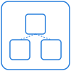
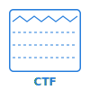

# OCM Marketing Diagram Primitives

Reusable SVG primitives for composing OCM exec/marketing diagrams. Each primitive is a self-contained `<svg>` with `viewBox`, brand-palette colors only, and Aptos/Inter typography. Drop them into PowerPoint via "Insert > Picture" and (where useful) right-click > "Convert to Shape" to recolor or regroup.

## Brand palette used

| Hex | Role |
| --- | --- |
| `#257DDC` | Brand Blue Dark - primary stroke / accent |
| `#1D65B4` | Brand Blue Mid - secondary deeper blue |
| `#4CC9F0` | Brand Cyan - highlights, SBOM differentiation |
| `#0A1530` | Brand Blue Night - air-gap / dark accents |
| `#000000` | Body text |
| `#6B7280` | Grey Mid - dotted lines, secondary |
| `#F3F4F6` | Grey Soft - tile fills |
| `#FFFFFF` | White |
| `#DC2626` | Red 600 - blocked / forbidden only |

## Containers / shapes

### `box-rounded.svg`
- **Size:** 240 x 80
- **Represents:** Generic labelled container.
- **When to use:** Any node in a flow that needs a short caption.
- **Preview:** 

### `box-tile.svg`
- **Size:** 320 x 180
- **Represents:** Slide-8 style content tile (3px Brand Blue Dark top rule, Grey Soft fill).
- **When to use:** Information tiles in 3-up or 4-up grid layouts.
- **Preview:** 

### `box-signed-envelope.svg`
- **Size:** 320 x 200
- **Represents:** A signed/sealed envelope - body with double-line border + circular seal in the top-right.
- **When to use:** "This bundle / component version is signed" callouts; pack-sign-transport diagrams.
- **Preview:** 

### `registry-cylinder.svg`
- **Size:** 80 x 100
- **Represents:** Registry / database (OCI, Helm repo, generic store).
- **When to use:** Source or target registry node in transport flows. Edit the bottom `<text id="label">` to retype.
- **Preview:** 

## Typed artifact pills

Use to label a connector or a content slot with the artifact type that flows through it. Pills are deliberately small (100 x 32) to attach to arrows and tiles.

### `pill-oci.svg`
- **Size:** 100 x 32
- **Represents:** OCI artifact resource type.
- **Preview:** 

### `pill-helm.svg`
- **Size:** 100 x 32
- **Represents:** Helm chart resource type.
- **Preview:** 

### `pill-npm.svg`
- **Size:** 100 x 32
- **Represents:** npm package resource type.
- **Preview:** 

### `pill-binary.svg`
- **Size:** 100 x 32
- **Represents:** Generic binary / blob resource.
- **Preview:** 

### `pill-config.svg`
- **Size:** 100 x 32
- **Represents:** Configuration artifact (values, manifest, etc.).
- **Preview:** 

### `pill-sbom.svg`
- **Size:** 100 x 32
- **Represents:** SBOM. Differentiated with Brand Cyan stroke + Brand Blue Mid label so it reads as metadata, not artifact.
- **When to use:** Anywhere you mark "SBOM travels with the bundle".
- **Preview:** 

## Identity / branding shapes

### `identity-chip.svg`
- **Size:** 180 x 40
- **Represents:** OCM coordinates / component identity tag (`name : version`).
- **When to use:** Anywhere you need to show an OCM identity (component reference, source, target).
- **Preview:** 

### `ocm-blob.svg`
- **Size:** 80 x 80
- **Represents:** Stylized OCM mark (hexagon + isometric pack-cube). NOT the official logo - it is intended as a diagram anchor only. Use the canonical OCM logo from `assets/ocm/` for headers and brand placement.
- **When to use:** "OCM" anchor node in flow diagrams.
- **Preview:** 

### `signature-mark.svg`
- **Size:** 36 x 36
- **Represents:** "This is signed" overlay badge (padlock circle).
- **When to use:** Stamp on top of any artifact / bundle to indicate it carries a signature.
- **Preview:** 

## Boundaries

Vertical separators (default 600px tall). Resize the height to span the diagram; they tile cleanly.

### `boundary-trust.svg`
- **Size:** 4 x 600
- **Represents:** Soft trust boundary (dashed grey).
- **When to use:** Org / team / network-zone separation that allows controlled traffic.
- **Preview:** 

### `boundary-airgap.svg`
- **Size:** 80 x 600
- **Represents:** Hard air-gap. Thick dark line broken in the middle with rotated "AIR GAP" label.
- **When to use:** Sovereign / air-gapped transport scenarios.
- **Preview:** 

### `boundary-jurisdiction.svg`
- **Size:** 16 x 600
- **Represents:** Jurisdictional / regulatory boundary (double rule + flag mast on top).
- **When to use:** Cross-border / regulated-domain transitions (DORA, GDPR, NIS2).
- **Preview:** 

## Connectors

### `arrow-solid.svg`
- **Size:** 200 x 24
- **Represents:** Active transfer / movement.
- **When to use:** Default flow arrow. Rotate/scale freely.
- **Preview:** 

### `arrow-dashed.svg`
- **Size:** 200 x 24
- **Represents:** Reference / lookup / passive read.
- **When to use:** When an artifact is referenced by identity, not transferred.
- **Preview:** 

### `arrow-loop.svg`
- **Size:** 80 x 80
- **Represents:** Continuous / day-2 / subscription loop.
- **When to use:** Reconciliation, subscription update, drift correction.
- **Preview:** 

### `arrow-blocked.svg`
- **Size:** 200 x 40
- **Represents:** Forbidden / unavailable connection (arrow with red X).
- **When to use:** Slide-3 fragmentation / "cannot reach this registry" callouts.
- **Preview:** 

## Targets / glyphs

### `k8s-cluster.svg`
- **Size:** 100 x 100
- **Represents:** Generic Kubernetes-shaped cluster target. Three node tiles in a frame - intentionally NOT the official K8s logo (avoids trademark risk).
- **When to use:** Deploy targets in transport / deploy diagrams.
- **Preview:** 

### `ctf-archive.svg`
- **Size:** 100 x 100
- **Represents:** Common Transport Format archive (zigzag / tar pattern with layer rules + CTF label).
- **When to use:** Air-gapped or sovereign transfer payload.
- **Preview:** 

### `question-mark-disconnect.svg`
- **Size:** 60 x 60
- **Represents:** Things don't connect cleanly (grey circled "?").
- **When to use:** Slide-3 fragmentation diagram and similar "uncertainty" callouts.
- **Preview:** 

## Badges / callouts

Pills that name a regulation, signing technology, or external standard. Mix-and-match in tile-grid slides.

### `badge-dora.svg`
- **Size:** 100 x 32
- **Represents:** DORA regulation badge (EU dot + label).
- **Preview:** 

### `badge-nis2.svg`
- **Size:** 100 x 32
- **Represents:** NIS2 regulation badge.
- **Preview:** 

### `badge-gdpr.svg`
- **Size:** 100 x 32
- **Represents:** GDPR regulation badge.
- **Preview:** 

### `badge-sigstore.svg`
- **Size:** 120 x 32
- **Represents:** Sigstore signing technology (padlock + label).
- **Preview:** 

### `badge-rsa.svg`
- **Size:** 100 x 32
- **Represents:** "Your existing RSA / PKI" - signals BYO crypto.
- **Preview:** 

### `badge-gpg.svg`
- **Size:** 140 x 32
- **Represents:** GPG / OpenPGP signing.
- **Preview:** 

## Composition tips

- Pair `box-rounded` (or `registry-cylinder`) endpoints with `arrow-solid` / `arrow-dashed` and a `pill-*` riding on the arrow midpoint.
- Use `boundary-*` lines vertically to split a slide into zones; they are designed to be height-stretched.
- Stamp `signature-mark` on the top-right of any artifact box to indicate signing without redrawing the box.
- For air-gap stories: `box-signed-envelope` -> `boundary-airgap` -> `ctf-archive` -> `boundary-jurisdiction` -> `k8s-cluster`.
