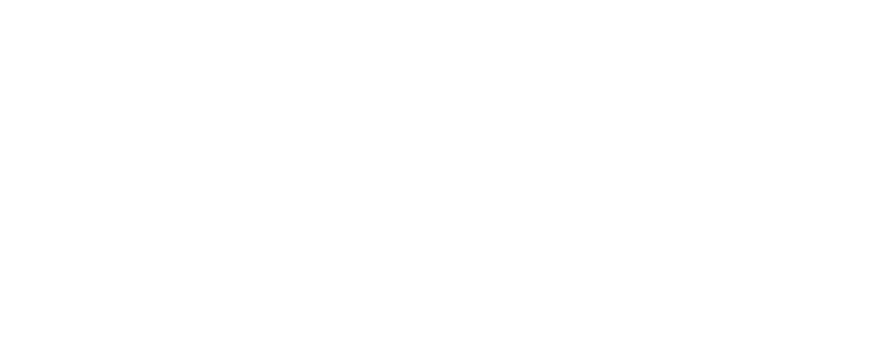
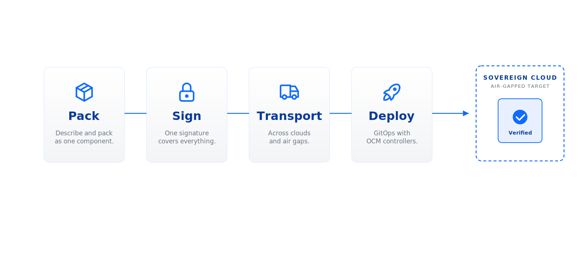

<!-- _class: hero-split -->

  <h1>Secure Delivery for Sovereign Clouds</h1>
  
Deliver and deploy your software securely. Anywhere, at any scale.

  
Open Component Model — open source, NeoNephos Foundation.

  
  

---

<!-- _class: three-col with-footer -->

### Why now — V1 · Sovereignty-led

# Sovereignty is no longer optional

### Sovereignty pressure

Wherever the law puts the boundary — by jurisdiction, sector, or air-gap — software must be deliverable, verifiable, and operable inside it.

### Regulation tightening

EU DORA · NIS2 · GDPR. Provable supply-chain control, not best effort.

### Supply-chain attacks are real

SolarWinds. xz. log4shell. Signatures must survive the journey, or compliance is theatre.

Open Component Model · ocm.software

---

<!-- _class: three-col with-footer -->

### Why now — V2 · Supply-chain-led

# Trust must travel with the artifact

### Supply-chain attacks are real

SolarWinds. xz. log4shell. When signatures break in transit, you lose the chain of custody.

### Regulation tightening

EU DORA · NIS2 · GDPR. Provable supply-chain control, not best effort.

### Sovereignty pressure

Wherever the law puts the boundary — by jurisdiction, sector, or air-gap — software must be deliverable, verifiable, and operable inside it.

Open Component Model · ocm.software

---

<!-- _class: three-col with-footer -->

### Why now — V3 · Fragmentation-led
# Compliance retrofits don't scale

### Software delivery is fragmented

Many teams, many stacks. Signatures break between them. SBOMs were never built for delivery.

### Regulation tightening

EU DORA · NIS2 · GDPR demand provable supply-chain control — not best effort.

### Sovereignty pressure

Wherever the law puts the boundary — by jurisdiction, sector, or air-gap — software must be deliverable, verifiable, and operable inside it.

Open Component Model · ocm.software

---

<!-- _class: diagram with-footer -->

### OCM in one picture

# Pack · Sign · Transport · Deploy

Open Component Model · ocm.software

---

<!-- _class: tiles with-footer -->

### What OCM unlocks

# One model unlocks all of this

  

    
    
Code signing across stacks

    
Sign once at source; verify everywhere, with no per-stack tooling.

  

  

    
    
Air-gapped delivery

    
Walk a complete component across an air gap; verify at destination.

  

  

    
    
Kubernetes-native deployment

    
OCM controllers deploy components directly into clusters.

  

  

    
    
Asynchronous security scans

    
Continuous scanning, even after release; findings tied to component identity.

  

  

    
    
Contextual CVE rescoring

    
Patch what matters in your context, not what a generic feed says.

  

  

    
    
Automated compliance reporting

    
Reports composed from SBoD metadata — no spreadsheet drift.

  

Open Component Model · ocm.software

