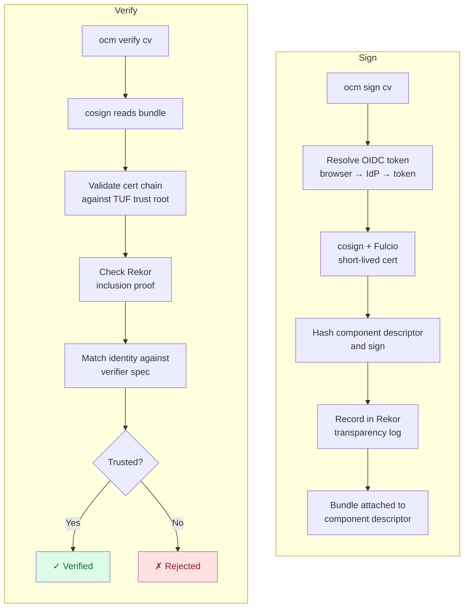

In this tutorial you'll sign an OCM component version with [Sigstore](https://www.sigstore.dev/) — no key pair to generate, no public key to distribute. Your OIDC identity (Google, GitHub, Microsoft, or your corporate IdP) is what proves authorship, and a verifier only needs to know which identity to trust.

For the conceptual background on key pinning vs. identity-based trust, see [Concept: Signing and Verification]().

## What You'll Learn

By the end of this tutorial, you will:

- Sign a component version using your OIDC identity instead of a private key
- Verify that signature using only an expected identity — no public key required
- Understand what Fulcio, Rekor, the OIDC IdP, and TUF each contribute to the flow
- Switch between public Sigstore and an enterprise Sigstore stack by changing only configuration

## Why this is easier than key-based signing

Sigstore replaces the long-lived key pair at the heart of [Plain Signatures]() and [Certificate Chains (PEM)]() with a short-lived certificate that's bound to your OIDC identity. Most of the operational work disappears.

| Aspect                  | RSA / PEM                    | Sigstore                                |
| ----------------------- | ---------------------------- | --------------------------------------- |
| Keys to manage          | Generate, store, protect     | None                                    |
| Public-key distribution | Verifiers need it            | Verifiers declare an identity to trust  |
| Key rotation            | Re-distribute new public key | Not applicable — certs are short-lived  |
| Audit trail             | None unless you build one    | Public, automatic (Rekor)               |

Read the table as "what you no longer have to think about." The rest of the tutorial walks through the small amount of configuration that *is* still required, and what each piece is doing under the hood.

## The Sigstore stack

Sigstore is four cooperating pieces. You don't deploy any of them yourself for the public-Sigstore happy path; for an enterprise stack a platform team has already deployed them and you only point your config at their endpoints.

- **OIDC IdP** — the identity provider you log in to (Google, GitHub, Microsoft, or your corporate IdP). The token it issues proves *who* is signing.
- **Fulcio** — a short-lived certificate authority. It accepts your OIDC token and issues a certificate (valid for ~10 minutes) that binds the token's identity claims to a fresh signing key.
- **Rekor** — an append-only public transparency log. Every signature is recorded so anyone can see when, and by whom, it was made.
- **TUF** — the mechanism clients use to discover the current trusted roots for Fulcio and Rekor. Your verifier uses it to know which CA and which log to trust.

The full flow during `ocm sign cv` and `ocm verify cv`:



**Estimated time:** ~15 minutes

## Prerequisites

- [OCM CLI installed]()
- A graphical browser on the same machine — the OIDC login flow opens a browser window
- A component version in a local CTF archive — we use `github.com/acme.org/helloworld:1.0.0` from [Create a Component Version](). Any component you can write to works.


The OCM CLI delegates Sigstore signing and verification to the [`cosign`](https://docs.sigstore.dev/cosign/) binary. If `cosign` is not on your `PATH` or its version is too low, OCM downloads and caches a compatible binary into `~/.cache/ocm/cosign/`. You don't need to install cosign separately.


## Scenario

Throughout this tutorial we use the same names and paths so every command can be copy-pasted as-is:

- **Component:** `github.com/acme.org/helloworld:1.0.0`
- **Working directory:** `/tmp/helloworld` (the CTF archive lives at `/tmp/helloworld/transport-archive`)
- **Signer files:** `sigstore-sign.yaml` (signer spec) and `.ocmconfig-sigstore-sign` (credentials)
- **Verifier files:** `sigstore-verify.yaml` (verifier spec) and `.ocmconfig-sigstore-verify` (credentials)

You'll act as both signer and verifier, so you'll see the full round trip with your own identity.

## Tutorial Steps





### Configure signer credentials

Sigstore signing needs two things from `.ocmconfig`: a **consumer identity** that says "this is a Sigstore-signing operation" and a **credential** that knows how to obtain an OIDC token. Pick the tab that matches your environment.




For public Sigstore (Google / GitHub / Microsoft via `oauth2.sigstore.dev`), you don't set an issuer or client ID — the `OIDCIdentityTokenProvider/v1alpha1` plugin uses public-good defaults.

```bash
cat > .ocmconfig-sigstore-sign <<'EOF'
type: generic.config.ocm.software/v1
configurations:
  - type: credentials.config.ocm.software
    consumers:
      - identity:
          type: SigstoreSigner/v1alpha1
          signature: default
        credentials:
          - type: OIDCIdentityTokenProvider/v1alpha1
EOF
```

`signature: default` matches the default name `ocm sign cv` uses when you don't pass `--signature`. If you later want a second Sigstore signing identity on the same component, add another consumer entry with a different `signature` name.




For an enterprise stack, the consumer identity carries the OIDC `issuer` and `clientID` of your corporate IdP. These two values must match the same fields you put in the signer spec (Step 2) so the credential graph routes to the enterprise OIDC plugin entry rather than the public-good default.

```bash
cat > .ocmconfig-sigstore-sign <<'EOF'
type: generic.config.ocm.software/v1
configurations:
  - type: credentials.config.ocm.software
    consumers:
      - identity:
          type: SigstoreSigner/v1alpha1
          signature: default
          issuer: https://oidc.acme.corp/.well-known/openid-configuration
          clientID: ocm-cli
        credentials:
          - type: OIDCIdentityTokenProvider/v1alpha1
EOF
```

Replace `oidc.acme.corp` and `ocm-cli` with the values your platform team gave you for the enterprise IdP.








### Sign the component version

The signer spec tells OCM *how* to sign. For public Sigstore it's a single line because cosign discovers Fulcio, Rekor, and TSA endpoints from the public-good TUF repository.

```bash
cat > sigstore-sign.yaml <<'EOF'
type: SigstoreSigningConfiguration/v1alpha1
EOF
```



For an enterprise stack, point at the cosign signing-config file your platform team provides and add the OIDC issuer / client ID:

```yaml
# sigstore-sign.yaml (enterprise)
type: SigstoreSigningConfiguration/v1alpha1
signingConfig: /etc/sigstore/signing_config.json
issuer: https://oidc.acme.corp/.well-known/openid-configuration
clientID: ocm-cli
```

`signing_config.json` is generated once per stack with `cosign signing-config create` — see the [cosign signing-config documentation](https://docs.sigstore.dev/cosign/system_config/signing_config/) for how to produce one.



Now sign the component version:

```bash
ocm sign cv \
  --config .ocmconfig-sigstore-sign \
  --signer-spec sigstore-sign.yaml \
  /tmp/helloworld/transport-archive//github.com/acme.org/helloworld:1.0.0
```

A browser window opens against your OIDC provider's login page. Authenticate, and you'll see an "OCM signing identity verified!" page — return to the terminal. Signing continues automatically: cosign asks Fulcio for a short-lived certificate, signs the component descriptor's hash, and records the result in Rekor.

<details>
<summary>Expected output</summary>

```text
time=2026-05-18T10:12:03.118+02:00 level=INFO msg="acquiring OIDC identity token" issuer=https://oauth2.sigstore.dev/auth
time=2026-05-18T10:12:08.402+02:00 level=INFO msg="OIDC identity token acquired"
time=2026-05-18T10:12:08.601+02:00 level=INFO msg="signing via Sigstore" fulcio=https://fulcio.sigstore.dev rekor=https://rekor.sigstore.dev
time=2026-05-18T10:12:11.972+02:00 level=INFO msg="signed successfully" name=default digest=91dd197868907487e62872695db1fa7b397fde300bcbae23e24abc188fb147ad hashAlgorithm=SHA-256 normalisationAlgorithm=jsonNormalisation/v4alpha1
```

</details>

> ✅ The signature is now part of your component version. No private key was generated, none lives on disk, and nothing needs to be distributed to verifiers — your OIDC identity is what the verifier will check.

Read back the recorded identity from the descriptor:

```bash
ocm get cv /tmp/helloworld/transport-archive//github.com/acme.org/helloworld:1.0.0 -o yaml \
  | yq '.[0].signatures[] | select(.signature.algorithm == "sigstore")'
```

Look for the OIDC issuer URL and the email you logged in with. **Note them down — you'll put exactly those values into the verifier spec in Step 4.** That's the entirety of "key distribution" with Sigstore: copy two strings.





### Configure verifier credentials

The verifier doesn't need a token — it just needs to know which Sigstore trust root to use. For public Sigstore that's distributed automatically via TUF, so the consumer entry has no `credentials` block at all. For an enterprise stack, you supply the trusted-root JSON file your platform team publishes.




```bash
cat > .ocmconfig-sigstore-verify <<'EOF'
type: generic.config.ocm.software/v1
configurations:
  - type: credentials.config.ocm.software
    consumers:
      - identity:
          type: SigstoreVerifier/v1alpha1
          signature: default
EOF
```

That's the entire credentials configuration. Cosign falls back to the public-good TUF repository for the trusted root.




```bash
cat > .ocmconfig-sigstore-verify <<'EOF'
type: generic.config.ocm.software/v1
configurations:
  - type: credentials.config.ocm.software
    consumers:
      - identity:
          type: SigstoreVerifier/v1alpha1
          signature: default
        credentials:
          - type: Credentials/v1
            properties:
              trusted_root_json_file: /etc/sigstore/trusted_root.json
EOF
```

`trusted_root.json` is your enterprise stack's trust root — produced once by the team that runs Fulcio/Rekor and shared with consumers. Replace the path with wherever your team distributes it.








### Verify the signature

The verifier spec is the entire trust configuration. Two fields decide which signatures you accept: the OIDC issuer (which IdP did the signer log in with) and the identity itself (the email or workload subject in the signing certificate).

```bash
cat > sigstore-verify.yaml <<'EOF'
type: SigstoreVerificationConfiguration/v1alpha1
certificateOIDCIssuer: https://github.com/login/oauth
certificateIdentity: jane.doe@example.com
EOF
```

Replace `certificateOIDCIssuer` and `certificateIdentity` with the values you read back at the end of Step 2 — the same OIDC issuer URL and email you logged in with. They must match exactly (trailing slashes and capitalization included).


On public Sigstore, the issuer recorded in the signing certificate is the **upstream identity provider's** issuer URL — *not* the Sigstore Dex endpoint. Pick the one matching the provider you logged in with:

| Logged in via | `certificateOIDCIssuer`             |
| ------------- | ----------------------------------- |
| Google        | `https://accounts.google.com`       |
| GitHub        | `https://github.com/login/oauth`    |
| Microsoft     | `https://login.microsoftonline.com` |





For an enterprise stack add `privateInfrastructure: true` and use your corporate IdP's issuer URL plus your corporate identity:

```yaml
# sigstore-verify.yaml (enterprise)
type: SigstoreVerificationConfiguration/v1alpha1
privateInfrastructure: true
certificateOIDCIssuer: https://oidc.acme.corp/
certificateIdentity: jane.doe@acme.corp
```

`privateInfrastructure: true` skips the public Rekor inclusion check — required when verifying signatures recorded against an enterprise transparency log instead of the public-good Rekor instance.



Verify the component version:

```bash
ocm verify cv \
  --config .ocmconfig-sigstore-verify \
  --verifier-spec sigstore-verify.yaml \
  /tmp/helloworld/transport-archive//github.com/acme.org/helloworld:1.0.0
```

<details>
<summary>Expected output</summary>

```text
time=2026-05-18T10:18:42.114+02:00 level=INFO msg="verifying signature" name=default
time=2026-05-18T10:18:42.612+02:00 level=INFO msg="signature verification completed" name=default duration=498.214ms
time=2026-05-18T10:18:42.612+02:00 level=INFO msg="SIGNATURE VERIFICATION SUCCESSFUL"
```

</details>

> ✅ **Success!** The component version is verified as authentic and signed by the OIDC identity you trust. No public key was distributed; no rotation needed.




## What You've Learned

- You signed an OCM component version **without ever generating a key pair**. Your OIDC login produced a short-lived certificate from Fulcio, and that certificate signed the component descriptor.
- You verified the signature **without distributing a public key**. The verifier spec just declared which identity to trust; cosign handled the rest.
- The four Sigstore pieces — Fulcio (cert), Rekor (log), the OIDC IdP, and TUF (trust roots) — cooperated automatically in the background.
- Switching from public Sigstore to an enterprise stack only changes a handful of config values (signing-config path, IdP issuer / client ID, trusted-root file). The OCM commands and the shape of the YAML files are identical.

## Check Your Understanding


Sigstore's signing certificate is short-lived but it's recorded in the public Rekor log along with the OIDC identity it was issued for. The verifier asks two questions: "is the certificate chain rooted in a Fulcio I trust (via TUF)?" and "does the identity inside that certificate match the one I'm willing to accept?" Both can be answered without ever holding the signer's public key, because the cert and its proof of inclusion are part of the bundle attached to the component descriptor.



New signatures from that identity stop working immediately — the IdP refuses to issue tokens, so there's no way to obtain a Fulcio certificate. Signatures already made remain verifiable, because the bundle on the descriptor doesn't depend on the IdP being live; it depends on Fulcio's CA and Rekor's log. If you want previously-issued signatures to stop being trusted, that's a *policy* decision you encode in your verifier spec (stop accepting that `certificateIdentity`), not a key-rotation operation.



Rekor is an append-only public log, so it protects against backdated signatures and against an attacker who later compromises the IdP and tries to mint a signature pretending to have happened earlier. Because every entry is timestamped and inclusion-proven, the verifier can check that the signing certificate was valid at the moment it was used, even though the certificate itself only lives for ~10 minutes.


## Troubleshooting

### Browser didn't open or "timed out waiting for authentication callback"

**Cause:** The OIDC interactive flow needs a graphical browser on the same machine running `ocm sign cv`, plus a free loopback port (`127.0.0.1`) for the OAuth callback.

**Fix:** Run on a workstation with a graphical browser. Headless or CI environments need a non-interactive identity flow (e.g. workload identity tokens supplied directly via credentials), which the [How-to: Sign Component Versions]() covers.

### "no matching identity in signing certificate"

**Cause:** Your verifier spec's `certificateIdentity` or `certificateOIDCIssuer` doesn't match what's actually in the signing certificate.

**Fix:** Re-read the recorded identity with the `yq` snippet from Step 2 and copy the values verbatim into `sigstore-verify.yaml`. Watch for trailing slashes and capitalization.

### "transparency log entry not found"

**Cause:** OCM couldn't reach Rekor (the public log Sigstore uses to record signatures), or the signature wasn't recorded there.

**Fix:** Check that you can reach `rekor.sigstore.dev` from the verifying machine. If the signature is recent and the network is fine, the signing flow likely failed to record the entry — ask the signer to re-sign.

### Enterprise: "trusted root not found" or "could not load trusted root"

**Cause:** `trusted_root_json_file` in `.ocmconfig-sigstore-verify` points at a file that doesn't exist, or that the OCM CLI can't read.

**Fix:** Check the path is absolute and the file is readable: `ls -l /etc/sigstore/trusted_root.json`. Ask your platform team for the canonical path if you don't have one.

For the full set of troubleshooting cases, see [How-to: Verify a Component Version]().

## Cleanup

Remove the files this tutorial created:

```bash
rm sigstore-sign.yaml sigstore-verify.yaml \
   .ocmconfig-sigstore-sign .ocmconfig-sigstore-verify
```

The component version itself stays signed — the signature lives inside the descriptor in `/tmp/helloworld/transport-archive`. If you want to remove that too, follow the cleanup section in [Create a Component Version]().

## Next Steps

- [How-to: Sign Component Versions]() — the fast-path reference for signing once you know the model
- [How-to: Verify Component Versions]() — full troubleshooting list for verification
- [Tutorial: Plain Signatures]() — RSA key-pair signing for comparison
- [Tutorial: Certificate Chains (PEM)]() — RSA + X.509 chain signing for PKI integration

## Related Documentation

- [Concept: Signing and Verification]() — the trust models behind OCM signing
- [ADR 0017: Sigstore Integration](https://github.com/open-component-model/open-component-model/blob/main/docs/adr/0017_sigstore_integration.md) — design and OIDC flow details
